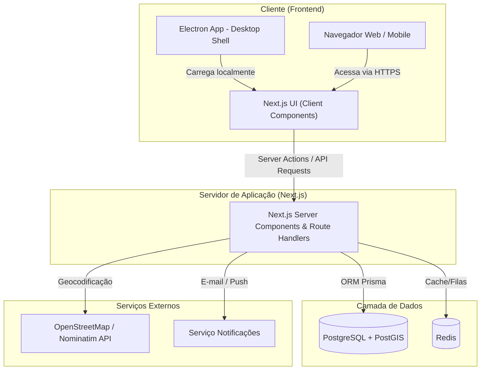

# Mesa Justa: Circuito Solidário

[](LICENSE)
[](https://nextjs.org/)
[](https://www.electronjs.org/)
[](https://www.postgresql.org/)

O **Mesa Justa: Circuito Solidário** é uma plataforma digital full-stack centralizada e cooperativa que conecta estabelecimentos comerciais que possuem excedentes de alimentos (supermercados, restaurantes, padarias) a organizações não governamentais (ONGs) e cozinhas comunitárias. O objetivo primordial é combater a insegurança alimentar e reduzir o desperdício de alimentos por meio de logística eficiente, geolocalização e transparência operacional.

A solução é disponibilizada como aplicação **Web Responsiva** e também como aplicativo **Desktop nativo via Electron** para uso nos caixas e escritórios operacionais.

---

## 📖 Índice

- [Problema & Valor Agregado](#-problema--valor-agregado)
- [Funcionalidades Principais (MVP)](#-funcionalidades-principais-mvp)
- [Stack Tecnológica](#-stack-tecnológica)
- [Arquitetura de Referência](#-arquitetura-de-referência)
- [Estrutura do Repositório](#-estrutura-do-repositório)
- [Como Iniciar localmente](#-como-iniciar-localmente)
- [Estratégia de Testes](#-estratégia-de-testes)
- [Conformidade Legal & Segurança Sanitária](#-conformidade-legal--segurança-sanitária)

---

## 🔍 Problema & Valor Agregado

Diariamente, toneladas de alimentos adequados para consumo são descartadas simplesmente por falta de canais estruturados de doação ou por lentidão na retirada de perecíveis. Ao mesmo tempo, ONGs gastam tempo excessivo com rotas ineficientes e comunicação fragmentada (mensagens/telefone).

### Nossas Personas
1.  **Carlos Oliveira (Doador)**: Gerente de estabelecimento comercial que busca disponibilizar excedentes em poucos cliques, reduzir custos de descarte e obter relatórios formais de impacto ESG.
2.  **Ana Silva (ONG)**: Gestora de instituição que precisa localizar doações disponíveis próximas à sua sede, planejar retiradas e obter comprovação ágil de recebimento.
3.  **Juliana Souza (Administradora)**: Controladora que gerencia cadastros, audita o histórico de retiradas e acompanha indicadores consolidados de impacto socioambiental.

---

## 🚀 Funcionalidades Principais (MVP)

-   **Cadastro e Autenticação RBAC**: Controle de acesso por perfis separados (Doador, ONG, Admin) com validação geográfica de operação inicial para os estados de **São Paulo (SP)** e **Minas Gerais (MG)**.
-   **Cadastro de Lotes de Doação**: Lançamento de alimentos com peso (kg), categoria, validade e recomendações de conservação.
-   **Busca e Filtro por Distância**: Algoritmo de geolocalização linear (fórmula de Haversine) que calcula a distância entre a ONG e os doadores.
-   **Mapa Interativo**: Exibição cartográfica em tempo real via **Leaflet.js** contendo pins com as doações mais próximas.
-   **Reserva Exclusiva**: Bloqueio de lote temporário para a ONG reservante, com geração de um **Token de Retirada** exclusivo de 6 caracteres (ex: `MJ-A94D`).
-   **Gamificação "Moeda Verde"**: Sistema que pontua estabelecimentos doadores com base no peso retirado ($1\text{ kg} = 10\text{ Moedas Verdes}$, com bônus para proteínas) e exibe um ranking mensal das empresas mais engajadas.
-   **Painel Administrativo ESG**: Indicadores agregados que estimam refeições complementadas e toneladas de emissão de CO2 evitadas nos aterros sanitários.

---

## 🛠 Stack Tecnológica

### Frontend
-   **React 18+** com **Next.js (App Router)** para renderização ultra-rápida (SSR/CSR).
-   **Vanilla CSS**: Estilo premium com CSS custom variables (cores institucionais verdes e âmbares), layout responsivo (Flexbox/Grid) e efeitos modernizados de *Glassmorphism*.
-   **Leaflet.js**: Renderização dos mapas com dados do *OpenStreetMap*.
-   **Electron**: Wrapper desktop nativo para Windows.

### Backend & Persistência
-   **Next.js API Route Handlers** & **Server Actions** em TypeScript (Node.js runtime).
-   **Prisma ORM** para mapeamento seguro e migrações tipadas.
-   **PostgreSQL** enriquecido com a extensão espacial **PostGIS** para consultas geométricas eficientes de proximidade.
-   **Redis** para cache de sessões e concorrência de reservas rápidas.

---

## 🏗 Arquitetura de Referência

A plataforma adota um padrão de **Full-Stack Monolith** com o Next.js consolidando rotas visuais e handlers de API no mesmo repositório:



---

## 📂 Estrutura do Repositório

O repositório está organizado da seguinte forma:

```text
├── docs/                      # Documentação de Especificação do Projeto
│   ├── prd.md                 # Requisitos de Produto (PRD)
│   ├── visao-de-produto.md    # Declaração do problema e personas
│   ├── spec_req.md            # Especificação formal de requisitos (SRS)
│   ├── spec_tech.md           # Detalhes de arquitetura técnica e stack
│   ├── spec_ui.md             # Layouts e diagramas de fluxo de interface
│   └── prompt_ux_stitch.md    # Prompt para ferramentas de prototipagem (ex: Google Stitch)
├── .env.example               # Modelo de variáveis de ambiente do sistema
├── .env                       # Arquivo de variáveis local (não commitado)
└── README.md                  # Este arquivo de documentação geral
```

---

## ⚙️ Como Iniciar Localmente

### Pré-requisitos
-   [Node.js](https://nodejs.org/) (versão 18 ou superior).
-   [Docker Compose](https://docs.docker.com/compose/) (para rodar o PostgreSQL e Redis locais).
-   [Git](https://git-scm.com/) para versionamento.

### Passo 1: Clonar o repositório
```bash
git clone https://github.com/fagundesedimar/mesaJusta.git
cd mesaJusta
```

### Passo 2: Configurar Variáveis de Ambiente
Copie o arquivo de exemplo e configure suas chaves de API locais (Clerk, Supabase, Vercel, etc.):
```bash
copy .env.example .env
```

### Passo 3: Iniciar Banco de Dados e Cache
Utilize o Docker Compose para subir os serviços locais:
```bash
docker-compose up -d
```

### Passo 4: Instalar as dependências e rodar as Migrations do Banco
```bash
npm install
npx prisma migrate dev
```

### Passo 5: Iniciar o servidor de desenvolvimento
-   **Web**: `npm run dev` (Acessível em `http://localhost:3000`)
-   **Desktop (Electron)**: `npm run dev:electron`

---

## 🧪 Estratégia de Testes

Garantimos a confiabilidade do Mesa Justa utilizando uma pirâmide abrangente de testes automatizados executados no pipeline de CI/CD:

1.  **Testes Unitários**:
    *   *Frontend (Jest + RTL)*: Validação de reatividade dos formulários e estados visuais.
    *   *Backend (Vitest)*: Testes das lógicas puras (Conversão de Moedas Verdes, Fórmula de Haversine).
    ```bash
    npm run test:unit
    ```
2.  **Testes de Contrato (Pact.io)**:
    *   Garante que a comunicação HTTP entre o desktop (Electron) e os Route Handlers do Next.js permaneça íntegra.
    ```bash
    npm run test:contract
    ```
3.  **Testes de Integração**:
    *   *Route Handlers (Supertest + Vitest)*: Executados contra instâncias reais de teste do banco de dados no contêiner local do Postgres.
    ```bash
    npm run test:integration
    ```
4.  **Testes End-to-End (Playwright)**:
    *   Simulação completa de fluxos do usuário (Cadastro de doação, reserva e retirada física com checagem de logs de auditoria).
    ```bash
    npm run test:e2e
    ```

---

## ⚖️ Conformidade Legal & Segurança Sanitária

-   **Segurança Sanitária**: A plataforma Mesa Justa atua estritamente como ferramenta de conexão e controle de software. A conformidade sanitária na manipulação, transporte e validação dos alimentos é de total responsabilidade civil do doador e da ONG coletora, de acordo com a **Lei nº 14.016/2020** e normas da **Anvisa**.
-   **LGPD**: Os dados pessoais e as geolocalizações exatas dos parceiros são protegidos por criptografia de repouso e restritos apenas às partes ativas no fluxo de reserva de cada lote de doações.
