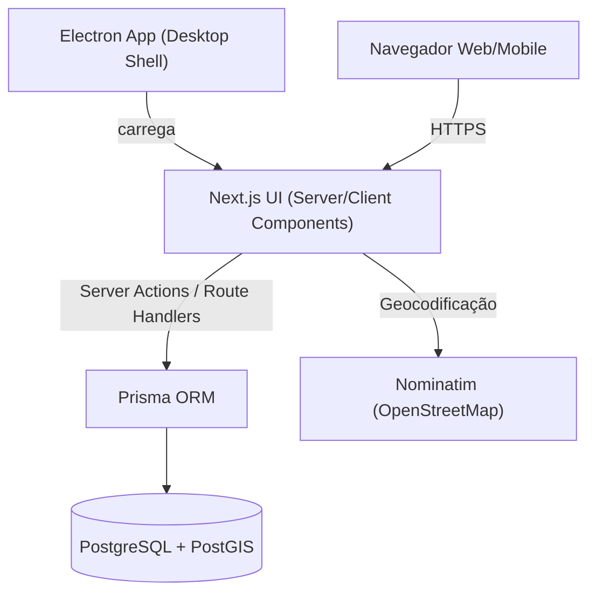

# ADR-0001 — Monolito Full-Stack com Next.js App Router e wrapper Electron

- **Status**: Aceita
- **Data**: 15/09/2026
- **Decisores**: Time de desenvolvimento Mesa Justa (com apoio de IA generativa agêntica)
- **Áreas afetadas**: Arquitetura, Frontend, Backend, Deploy

---

## Contexto

O Mesa Justa precisa entregar um MVP completo (autenticação + RBAC, cadastro de doações, busca por proximidade com mapa, reserva com token, auditoria, gamificação e painel administrativo) em um único projeto, com duas superfícies de entrega: **Web responsiva** e **Desktop nativo (Windows)**. O time é pequeno e o ciclo de validação é curto.

Os requisitos não funcionais (RNF-01: latência < 200 ms p95; RNF de rastreabilidade de auditoria; multi-tenancy lógico) estão formalizados em `docs/spec_req.md`.

## Decisão

Adotar um **Full-Stack Monolith**: o Next.js (App Router) serve simultaneamente a camada visual (Server/Client Components) e a camada de API (Route Handlers + Server Actions), consolidando tudo em um único repositório. Um wrapper **Electron** carrega a mesma aplicação Web como cliente desktop nativo para os caixas das ONGs e estabelecimentos.

Representação (consistentes com `docs/spec_tech.md` e `README.md`):

## Alternativas consideradas

| Alternativa | Motivo da rejeição |
|---|---|
| Frontend e Backend separados (SPA + API dedicada) | Dois deploys, contrato CORS, mais infra para um time pequeno; contrato já coberto por testes Pact num monólito |
| Microserviços | Over-engineering para o MVP; complexidade de rede/observabilidade não paga o custo no volume piloto |
| Next.js `output: 'export'` (estático puro) | Quebra Route Handlers; impossibilita delegação espacial ao PostGIS via server |
| Electron carregando o frontend estático sem servidor | Não permite manter autenticação e auditoria server-side integradas |

## Consequências

**Positivas**
- Um único deploy (Vercel) / um único artefato; menor superfície de configuração.
- Testes unitários, de contrato (Pact), de integração e E2E rodam no mesmo repositório e pipeline.
- O Electron reutiliza o mesmo bundle de servidor (mantém Route Handlers funcionais), conforme `openspec/specs/electron-wrapper/spec.md`.

**Negativas / trade-offs assumidos**
- Escala de equipe e de tráfego limitada — aceito para o piloto; separação é uma refatoração futura viável.
- Queries espaciais brutas via `prisma.$queryRaw` contornam o type-safety do Prisma (compensado por tipagem manual e testes de integração — ver `ADR-0002`).
- Não é possível servir e escalar APIs e frontend de forma independente (necessário para o MVP).

## Referências

- `docs/spec_tech.md` (Arquitetura de Referência, linhas 11-47)
- `README.md` (Arquitetura de Referência, linhas 66-90)
- `openspec/specs/electron-wrapper/spec.md`
- `openspec/changes/archive/2026-06-25-electron-wrapper/design.md`