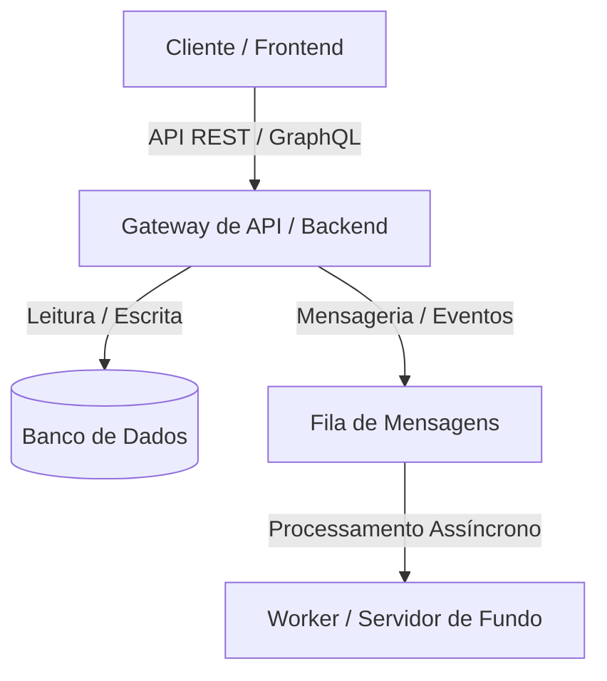
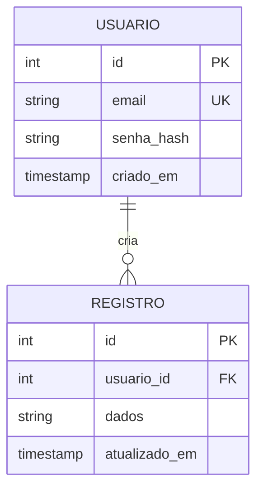

# Especificação Técnica de Sistema: [Nome do Sistema]

Este documento descreve as especificações técnicas, arquiteturais e funcionais do sistema **[Nome do Sistema]**. Ele serve como fonte da verdade para o time de desenvolvimento, qualidade e operações (DevOps).

---

## Controle de Versões

| Versão | Data | Autor | Descrição das Alterações |
| :--- | :--- | :--- | :--- |
| 1.0.0 | [Data] | [Autor] | Definição inicial da especificação e escopo básico. |

---

## 1. Introdução e Contexto

### 1.1 Objetivo do Sistema
Uma breve descrição do propósito do sistema. Qual problema de negócio ou de engenharia este software resolve? Quem são os principais beneficiários?

### 1.2 Limites do Sistema (Escopo)
*   **O que está no escopo:** Funcionalidades principais a serem desenvolvidas na fase atual.
*   **O que está fora do escopo:** Funcionalidades ou integrações expressamente excluídas desta fase de implementação.

### 1.3 Glossário e Definições
*   **Termo A:** Explicação do termo técnico ou de domínio do negócio.
*   **Termo B:** Explicação do termo.

---

## 2. Visão Geral da Arquitetura

Descreva como os diferentes componentes do sistema interagem de forma macro.



### 2.1 Stack Tecnológica Recomendada
*   **Frontend:** [Ex: React, Next.js, Vue, iOS Native, etc.]
*   **Backend:** [Ex: Node.js, Go, Python, Java, etc.]
*   **Persistência:** [Ex: PostgreSQL, MongoDB, Redis, etc.]
*   **Infraestrutura / Deploy:** [Ex: Docker, Kubernetes, AWS, Vercel, etc.]

---

## 3. Requisitos Funcionais (RF)

Os Requisitos Funcionais descrevem o comportamento dinâmico esperado do sistema (as ações que o sistema deve executar).

### [RF-001] [Título do Requisito]
*   **Descrição:** O que o sistema deve fazer em termos de fluxo de negócios.
*   **Atores:** Quem interage ou inicia a ação.
*   **Critérios de Aceitação:**
    -   [ ] Cenário 1: Entrada válida gera resultado esperado.
    -   [ ] Cenário 2: Tratamento de exceção em caso de dados inválidos.

### [RF-002] [Título do Requisito]
*   **Descrição:** ...
*   **Atores:** ...
*   **Critérios de Aceitação:** ...

---

## 4. Requisitos Não Funcionais (RNF)

Os Requisitos Não Funcionais definem as qualidades, restrições e padrões do sistema.

| ID | Categoria | Descrição do Requisito | Critério de Medição / Validação |
| :--- | :--- | :--- | :--- |
| **RNF-001** | Desempenho | Latência de requisições de leitura. | 95% das requisições respondidas em < 200ms. |
| **RNF-002** | Segurança | Criptografia de dados sensíveis. | Dados sensíveis (senhas, chaves) encriptados com hash Bcrypt ou similar. |
| **RNF-003** | Disponibilidade | SLA operacional de infraestrutura. | SLA mínimo de 99.9% de uptime anual. |
| **RNF-004** | Escalabilidade | Volume de requisições concorrentes. | Suportar até X usuários simultâneos com auto-scaling ativo. |

---

## 5. Arquitetura de Dados (Modelagem Conceitual)

### 5.1 Entidades Principais e Relacionamentos
Indique como as tabelas/coleções primárias estão estruturadas.



---

## 6. Integrações e Comunicação (APIs)

Descreva brevemente os endpoints primários necessários para o funcionamento do sistema ou como ele interage com serviços terceiros.

### Endpoint: `POST /api/v1/resource`
*   **Descrição:** Cria um novo recurso no sistema.
*   **Payload de Exemplo (JSON):**
    ```json
    {
      "campo_exemplo": "valor",
      "ativo": true
    }
    ```
*   **Respostas Esperadas:**
    -   `201 Created`: Recurso gerado com sucesso.
    -   `400 Bad Request`: Payload malformado ou campos obrigatórios ausentes.

---

## 7. Premissas e Restrições Técnicas
*   **Premissa 1:** O usuário final possui acesso à internet estável.
*   **Restrição 1:** O sistema deve ser compatível com a LGPD (Lei Geral de Proteção de Dados) ou GDPR.
