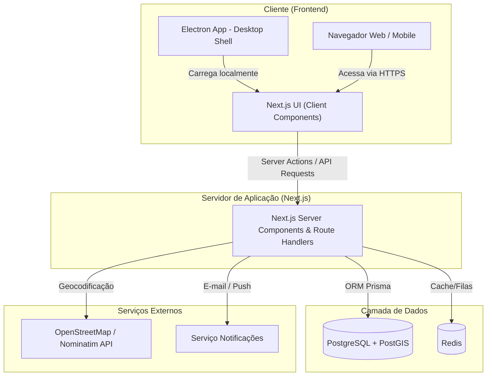
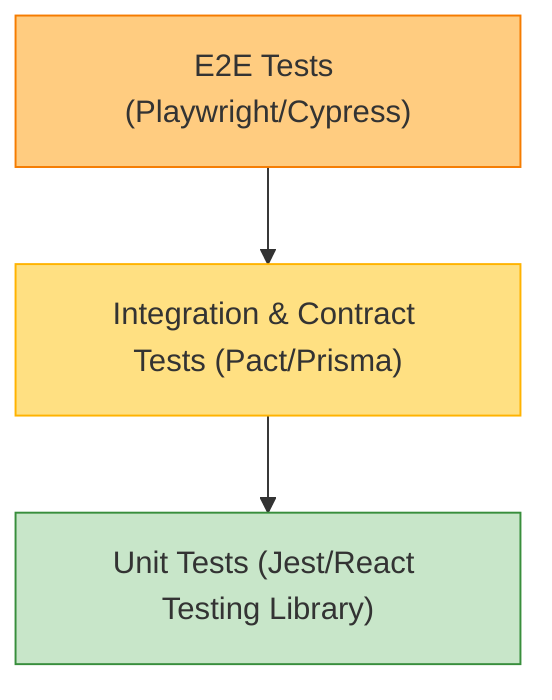

# Especificação Técnica - Mesa Justa: Circuito Solidário

## Visão Geral Técnica

Este documento tem como objetivo definir as diretrizes arquiteturais, a stack tecnológica, as políticas de segurança e a modelagem técnica do sistema **Mesa Justa: Circuito Solidário**. 

O público-alvo deste documento inclui desenvolvedores de software, engenheiros de DevOps, especialistas em segurança, analistas de garantia de qualidade (QA) e ferramentas de Inteligência Artificial assistidas que atuarão na codificação e implantação do sistema. O escopo técnico abrange tanto a estrutura do MVP (com persistência simulada em LocalStorage e empacotamento via Electron) quanto a arquitetura de produção escalável voltada para nuvem.

---

## Arquitetura de Referência

O sistema adota um padrão arquitetural de **Full-Stack Monolith** utilizando **Next.js (App Router)**. O Next.js consolida tanto a camada de interface (Client-Side Rendering e Server-Side Rendering) quanto a camada de API Backend (Route Handlers e Server Actions) em uma única base de código integrada, simplificando o desenvolvimento, testes e implantação na fase piloto.

### Decisões Técnicas Resumidas:

- **Estilo Arquitetural**: Full-stack Monolith estruturado sob a pasta `/app` do Next.js (App Router), separando rotas visuais (`/app/dashboard`, etc.) de rotas de dados/APIs (`/app/api/...`) com clara divisão lógica de domínios.
- **Componentes Principais**:
  - **Frontend/Backend Unificado**: Next.js servindo componentes do lado servidor (RSC) e do lado cliente, empacotável para Desktop com Electron (configurado para carregar rotas locais estáticas ou apontar para o servidor dev/produção web).
  - **Banco de Dados**: PostgreSQL com extensão espacial PostGIS para armazenamento de coordenadas e buscas espaciais de doações baseadas em distância.
- **Serviço de Observabilidade**: Winston/Pino integrado aos Route Handlers do Next.js para formatação estruturada de logs. Sentry SDK para monitoramento de erros de runtime (Client e Server do Next.js), e Vercel Analytics/Prometheus para telemetria.
- **Autenticação e Autorização**: Tokens JWT baseados em Cookies HttpOnly e Server Actions de autenticação, controlando o fluxo RBAC (Role-Based Access Control) diretamente nas rotas e layouts do Next.js Middleware.
- **Protocolos de Comunicação**: HTTPS para requisições REST/Server Actions. Notificações de retirada em tempo real e chats de suporte utilizando WebSockets (via Socket.io em servidor autônomo auxiliar ou Serverless WebSockets como Pusher/AWS API Gateway).
- **Infraestrutura de Deployment**: Hospedagem da aplicação Next.js unificada na Vercel (nativo) ou em contêineres Docker na AWS (ECS Fargate) atrás de um Load Balancer.

---

## Stack Tecnológica

### Frontend

- **Linguagem**: TypeScript / JavaScript (ES6+).
- **Framework web**: Next.js (App Router) + React 18+.
- **Estilização**: Vanilla CSS (CSS puro utilizando Variáveis CSS, Flexbox e Grid Layouts para performance e fidelidade ao design).
- **Biblioteca de Mapas**: Leaflet.js (ou React-Leaflet) para mapas interativos OpenStreetMap.
- **Wrapper Desktop**: Electron (encapsula a aplicação Next.js para uso nativo no Windows).

### Backend

- **Linguagem**: TypeScript.
- **Runtime**: Node.js (v18 ou superior) integrado no Next.js API Routes (Route Handlers).
- **Framework**: Next.js Route Handlers e Server Actions.
- **Persistência**: PostgreSQL com extensão espacial PostGIS. LocalStorage (para cache local offline e MVP).
- **ORM**: Prisma ORM para queries seguras e migrações tipadas.

### Stack de Testes

- **Testes Unitários (Frontend/Backend)**: 
  - Jest + React Testing Library (para componentes, custom hooks e páginas do Next.js).
  - Vitest / Jest (para lógica de negócio isolada, helpers matemáticos e validadores Zod).
- **Testes de Contrato**:
  - Pact.io (para garantir a integridade de chamadas HTTP entre o front-end Electron/Web e os Route Handlers do Next.js).
- **Testes de Integração**:
  - Supertest + Vitest/Jest (para testar os Route Handlers do Next.js simulando requisições e verificando respostas).
  - Prisma Client mockado ou rodando em banco Docker local para testar queries e regras de banco de dados.
- **Testes End-to-End (E2E)**:
  - Playwright ou Cypress (para simulação de jornadas completas como o fluxo "Doador cadastra alimento -> ONG visualiza no mapa e reserva -> Doador valida com token").
- **Testes de Regressão Visual**:
  - Playwright Visual Comparisons (comparação de screenshots para evitar desconfiguração do layout responsivo e mapa).

### Stack de Desenvolvimento

- **IDE**: Visual Studio Code (VS Code) com extensões de ESLint, Prettier, Prisma e Jest.
- **Gerenciamento de pacotes**: npm (Node Package Manager).
- **Ambiente de desenvolvimento local**: Docker Compose contendo contêineres do PostgreSQL/PostGIS e do Redis.
- **Infraestrutura como Código (IaC)**: Terraform para provisionamento de recursos de produção na AWS.
- **Pipeline CI/CD**: GitHub Actions executando linter, testes unitários, testes de contrato, testes de integração em container, compilação estática do Next.js, empacotamento Electron e deploy automatizado.

### Integrações

- **Persistência**: LocalStorage (MVP/Cache offline) / Banco de dados relacional PostgreSQL remoto.
- **Deployment**: Electron Builder (instalador Desktop `.exe`) e Vercel (servidor Web nativo do Next.js) / AWS ECS (Docker).
- **Segurança (Autenticação e Autorização)**: `bcryptjs` no servidor para hash de senhas, `jose` / `jsonwebtoken` para assinatura de JWTs.
- **Observabilidade**: Winston/Pino + Sentry SDK integrado no Next.js (Edge e Node runtime).

---

## Estratégia de Testes

Para garantir a qualidade, resiliência sanitária e segurança da plataforma Mesa Justa, adota-se a Pirâmide de Testes automatizados cobrindo todas as camadas da aplicação Next.js e do wrapper Electron.

### 1. Testes Unitários

- **Frontend (UI Components & Hooks)**: 
  - Foco na validação visual de componentes isolados (ex: formulário de cadastro de doação, listagem de rankings, sidebar).
  - Framework: Jest e `@testing-library/react`.
  - Escopo: Validar que os campos de input de formulário reagem a validações locais (ex: bloquear data de expiração retroativa).
- **Backend/Helpers (Regras de Negócio)**:
  - Foco nas funções de utilidade pura (cálculo de coordenadas Haversine, conversão de peso em Moedas Verdes, formatação de dados).
  - Framework: Vitest / Jest.

### 2. Testes de Contrato

- **Objetivo**: Garantir que alterações nas rotas de API do Next.js (`/app/api/...`) não quebrem a comunicação com a interface cliente em execução nos desktops do Electron ou navegadores mobile.
- **Framework**: Pact.io.
- **Fluxo**:
  - O consumidor (Frontend React/Electron) define o contrato (payloads e respostas esperados para buscar doações e realizar reservas).
  - O provedor (Next.js Route Handlers) valida que suas respostas reais respeitam o contrato acordado no pipeline de CI/CD.

### 3. Testes de Integração

- **API Route Handlers**:
  - Validação do fluxo completo de requisições HTTP sem renderização visual.
  - Framework: Vitest + Prisma Client rodando contra uma instância local temporária de PostgreSQL/PostGIS (via Docker Compose no CI/CD).
  - Escopo: Enviar um `POST /api/v1/reservations` válido, confirmar que o status da doação mudou para `Reservada` no banco de dados e que uma entrada foi criada no log de auditoria de segurança.
- **Persistência de Cache**:
  - Testar o comportamento do cache de sessão e dados temporários no LocalStorage e no Redis (testes de concorrência de reservas simultâneas).

### 4. Testes End-to-End (E2E)

- **Objetivo**: Simular a jornada real dos usuários do sistema, cobrindo o fluxo do início ao fim (cadastro de usuário, login, cadastro de alimento, visualização de mapa, reserva, confirmação de retirada e pontuação).
- **Framework**: Playwright (suporta testes multi-browser e simulação de tamanhos de tela mobile e desktop).
- **Ambiente**: Executado contra um ambiente de homologação (Staging) isolado que é reiniciado a cada ciclo de pipeline.
- **Métricas de Aceitação**: 100% dos fluxos principais descritos nas Histórias de Usuário devem passar com sucesso antes de qualquer release.

### 5. Testes de Regressão Visual

- **Objetivo**: Garantir que as atualizações de CSS puro (Vanilla CSS) não quebrem a interface com o usuário em diferentes resoluções.
- **Framework**: Playwright Visual Comparisons.
- **Metodologia**: Captura de tela automatizada e comparação de pixel por pixel contra imagens "baseline" homologadas do layout mobile e desktop.

---

## Segurança

### Autenticação e Gestão de Sessão

- **Senhas Seguras**: O armazenamento de senhas de usuários no banco de dados exige criptografia de via única por meio do algoritmo Bcrypt com fator de custo (Salt) de no mínimo 10.
- **Tokens de Acesso**: Utilização de JSON Web Tokens (JWT) com assinatura assimétrica (RS256) ou simétrica forte (HS256). Os tokens devem possuir tempo de expiração curto (ex: 15 minutos) acompanhados por um sistema de rotação de Refresh Tokens seguros armazenados em cookies HTTP-Only no navegador.
- **Prevenção de Sequestro de Sessão**: Cookies que carregam informações de sessão devem ser configurados com as flags `Secure`, `HttpOnly` e `SameSite=Strict`.

### Controle de Acesso e Autorização

- **Controle de Acesso Baseado em Papéis (RBAC)**: O sistema de autorização interceptará as rotas de API por meio do Next.js Middleware (`middleware.ts`) que checa o escopo (`role`) contido na assinatura do JWT.
- **Segurança no Nível da Linha (Row-Level Security - RLS)**: Em consultas a recursos de doação e auditoria, o Next.js Server Side deve injetar o ID do usuário autenticado no filtro da query SQL para garantir que um estabelecimento não consiga alterar ou visualizar detalhes de doações de outros, e que uma ONG acesse apenas as suas próprias reservas.

### Segurança de Dados e Validação

- **Validação de Input**: Todas as entradas do usuário (corpo de requisições, parâmetros de rota e query strings) devem passar por validação rigorosa na borda da API usando esquemas tipados (como a biblioteca Zod).
- **Sanitização contra XSS**: Inputs textuais vindos do front-end devem ser limpos e codificados no momento da exibição para evitar injeção de scripts (XSS).
- **Proteção contra SQL Injection**: Uso obrigatório de consultas parametrizadas (Prepared Statements) fornecidas nativamente pelo ORM Prisma. A execução de queries brutas (`raw query`) é proibida, exceto para operações espaciais PostGIS validadas.

#### Criptografia e Proteção de Dados

- **Dados em Trânsito**: Comunicação cliente-servidor protegida de ponta a ponta por criptografia HTTPS utilizando o protocolo TLS 1.3 (e TLS 1.2 como fallback).
- **Dados Sensíveis em Repouso**: Criptografia AES-256 aplicada no nível do armazenamento de dados em produção (AWS RDS Storage Encryption) e dados pessoais identificáveis (como telefones ou CPFs de responsáveis) criptografados opcionalmente no nível da aplicação.

### Segurança da Infraestrutura e Configuração

- **Variáveis de Ambiente**: Credenciais de banco de dados, chaves de assinatura JWT e chaves de APIs parceiras nunca devem ser mantidas em código fonte. Devem ser injetadas em tempo de execução via variáveis de ambiente configuradas em serviços de gerenciamento de segredos (ex: AWS Secrets Manager ou variáveis seguras do repositório no CI/CD).
- **Ambiente Isolado (VPC)**: O banco de dados PostgreSQL e o cache Redis devem ser implantados em sub-redes privadas dentro de uma VPC, inacessíveis diretamente pela internet pública, sendo acessados unicamente pelos Serverless Route Handlers/API do Next.js por meio de regras estritas de Security Group.

### Segurança no Desenvolvimento e Operação (DevSecOps)

- **Análise Estática de Vulnerabilidades**: Integração de ferramentas como Snyk ou npm audit nas esteiras de CI/CD para detectar pacotes NodeJS com vulnerabilidades conhecidas antes de cada build.
- **Varredura de Segredos**: Utilização de ferramentas como `git-secrets` para prevenir que chaves de API sejam commitadas acidentalmente no repositório.
- **Automação de Testes de Segurança**: Execução automatizada de toda a gama de testes (unitários, contrato, integração e E2E) no pipeline do GitHub Actions para garantir que nenhuma alteração introduza regressões de lógica ou acessos indevidos.

---

## APIs

O sistema expõe uma API RESTful corporativa implementada por meio de **Next.js API Route Handlers** (mapeados sob a estrutura de diretórios `/app/api/...`) e Server Actions.

### Diretrizes Gerais:
- **Endpoint Principal**: `/api/v1` (versionamento mantido no caminho físico da rota para suportar clientes desktop Electron).
- **Padrão de Nomenclatura**: RESTful clássico utilizando substantivos no plural em inglês (ex: `/api/v1/donations`).
- **Autenticação**: Via cabeçalho `Authorization: Bearer <JWT>` ou Cookies HttpOnly validados pelo Next.js Middleware.

### Endpoints Principais (MVP)

#### Públicos (Sem autenticação):
- `POST /api/v1/auth/register` - Cadastro de novos estabelecimentos ou ONGs.
- `POST /api/v1/auth/login` - Autenticação e emissão de JWT / Cookie de Sessão.

#### Protegidos (Requer autenticação ativa):
- `GET /api/v1/donations` - Lista doações ativas filtradas e ordenadas por geolocalização.
- `POST /api/v1/donations` - Cadastro de lote de alimentos (Apenas Perfil Doador).
- `PATCH /api/v1/donations/:id/status` - Transição de status da doação (Disponível, Reservada, Retirada, Cancelada, Expirada).
- `POST /api/v1/reservations` - Realiza a reserva de um lote e gera o Token de Retirada (Apenas Perfil ONG).
- `POST /api/v1/reservations/confirm` - Confirmação da retirada validando o Token (Doador/ONG).
- `GET /api/v1/admin/dashboard` - KPIs consolidados de impacto e listagem do log de auditoria.
- `GET /api/v1/gamification/ranking` - Classificação dos doadores baseados em Moedas Verdes.

---

## Tenancy

O Mesa Justa adota um modelo de **Multi-tenancy Lógico (Banco de Dados Compartilhado com Separação Lógica)**. Por se tratar de um ecossistema cooperativo onde doadores locais e ONGs locais interagem, a separação rígida por bancos de dados físicos isolados não é adequada, pois impediria a descoberta de doações entre diferentes entidades na mesma região geográfica.

- **Estratégia de Isolamento**: Os dados são isolados logicamente com base nas chaves estrangeiras `establishment_id`, `ngo_id` e nos escopos geográficos de estado/município.
- **Segurança de Acesso**: Cada consulta SQL gerada pelas APIs deve injetar um filtro de segurança garantindo que os usuários acessem exclusivamente recursos autorizados de seu ecossistema. 
- **Identificação do Locatário (Tenant)**: No momento do login, o identificador do estabelecimento ou da ONG é decodificado do token JWT do usuário, sendo repassado para todas as consultas do ciclo de vida da requisição (Request Context).
- **Migrações de Banco**: Gerenciadas de forma centralizada pelo Prisma Migrate. Modificações na estrutura da tabela afetam todas as organizações de forma unificada e simultânea, necessitando de testes de regressão automatizados para evitar indisponibilidade do ecossistema.

---

## Diretrizes para Desenvolvimento Assistido por IA

Ao utilizar ferramentas de IA para gerar código ou manter a plataforma Mesa Justa, siga as seguintes instruções imperativas:

1. **Vanilla CSS Estrito**: A estilização deve utilizar arquivos CSS nativos (`src/index.css`) sem bibliotecas de utilitários como Tailwind CSS (a menos que explicitamente ordenado pelo usuário). Os estilos devem fazer uso rigoroso de propriedades personalizadas (CSS Variables) para cores, fontes e espaçamentos definidos no design system do projeto.
2. **Tipagem Estrita em TypeScript**: Todos os novos módulos, componentes ou funções devem possuir assinaturas completas de tipo. Evite o uso de tipos genéricos ou indefinidos como `any`.
3. **Padrão de Manipulação de Status**: Qualquer fluxo de alteração de status na tabela de doações deve obrigar a gravação correspondente na tabela/coleção de logs de auditoria. Nunca modifique o status de uma doação sem registrar o autor e o token envolvido.
4. **Resiliência e Simulação no MVP**: Quando rodando no modo MVP, a IA deve garantir que os módulos de serviço (`src/services/db.js` e `src/services/geo.js`) usem `LocalStorage` de forma transparente caso a conexão com a API de produção falhe ou não esteja configurada no ambiente.
5. **Legibilidade e Código Limpo**: Escreva códigos limpos, modulares e autoexplicativos. Mantenha comentários detalhados e javadoc/JSDoc documentando parâmetros de entrada e saídas de métodos críticos.
