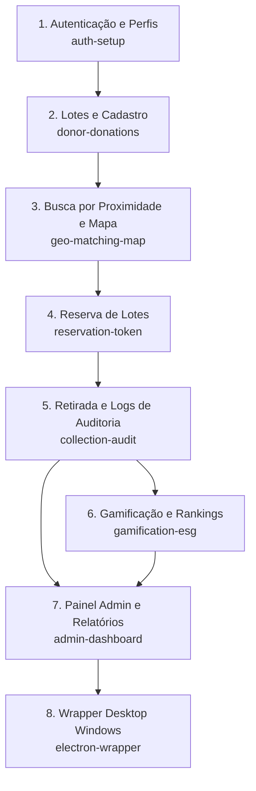

# Roadmap de Implementação Incremental - Mesa Justa: Circuito Solidário

Este documento apresenta o planejamento incremental para a implementação do MVP do **Mesa Justa**, dividindo as funcionalidades em 8 mudanças estruturadas. Nenhuma mudança possui tamanho, complexidade ou risco maior que **Médio**, garantindo um fluxo ágil de desenvolvimento e qualidade constante.

---

## 🗺️ Mapa Visual de Dependências

---

## 📱 Mapeamento de Telas (Stitch) para as Mudanças

Os protótipos visuais importados do Stitch foram associados a cada etapa para garantir fidelidade visual ao design system baseado em **Vanilla CSS** e **Glassmorphism**:

1. **[auth-setup](file:///C:/Users/gusta/Desktop/MesaJusta/mesaJusta/openspec/changes/auth-setup/proposal.md)**: Mapeado para a tela **Login e Cadastro** (`8cac23cd060946ff81762496d5609d69`).
2. **[donor-donations](file:///C:/Users/gusta/Desktop/MesaJusta/mesaJusta/openspec/changes/donor-donations/proposal.md)**: Mapeado para a tela **Dashboard Doador - Carlos** (`00ee87a028e1470e9529aedefd3409f1`) e para o modal **Novo Lote de Alimentos** (`5be298a758ba4f508178e1035ace7301`).
3. **[geo-matching-map](file:///C:/Users/gusta/Desktop/MesaJusta/mesaJusta/openspec/changes/geo-matching-map/proposal.md)**: Mapeado para a tela **Dashboard ONG - Ana** (`02fbebc52cb84cec87be2d445c72d37a`) e **Mapa de Doações** (`cc426bdf2bf44a45907c3a27d8f0bc22`).
4. **[reservation-token](file:///C:/Users/gusta/Desktop/MesaJusta/mesaJusta/openspec/changes/reservation-token/proposal.md)**: Mapeado para a tela **Minhas Reservas - ONG** (`ba7e9a72e8374015862ad60aba832470`).
5. **[collection-audit](file:///C:/Users/gusta/Desktop/MesaJusta/mesaJusta/openspec/changes/collection-audit/proposal.md)**: Integração com botões e validações no Dashboard Doador e Reservas da ONG.
6. **[gamification-esg](file:///C:/Users/gusta/Desktop/MesaJusta/mesaJusta/openspec/changes/gamification-esg/proposal.md)**: Integração com componentes de conquistas do Doador e ranking público.
7. **[admin-dashboard](file:///C:/Users/gusta/Desktop/MesaJusta/mesaJusta/openspec/changes/admin-dashboard/proposal.md)**: Mapeado para a tela **Painel Administrativo - Juliana** (`69c24ea7ca4b41fbb13b8ea6593b7bb5`).
8. **[electron-wrapper](file:///C:/Users/gusta/Desktop/MesaJusta/mesaJusta/openspec/changes/electron-wrapper/proposal.md)**: Empacotamento de toda a aplicação web para execução Desktop local no Windows.

---

## 📋 Resumo das Mudanças Propostas

> [!IMPORTANT]
> Em conformidade com a política de qualidade do projeto, **nenhuma mudança é considerada concluída sem a aprovação e execução bem-sucedida dos testes correspondentes (Linter, Unitários, Integração e E2E)**.

| Mudança / Link | Escopo Funcional Resumido | Dependências | Risco | Testes Principais |
| :--- | :--- | :--- | :--- | :--- |
| **1. [auth-setup](file:///C:/Users/gusta/Desktop/MesaJusta/mesaJusta/openspec/changes/auth-setup/proposal.md)** | Login, Cadastro (validação de CPF/CNPJ, CEP em SP e MG), JWT em Cookies HttpOnly e Middleware RBAC. | Nenhuma | Médio | Unitário CPF/CNPJ, Integração API e Middleware, E2E de cadastro e bloqueios. |
| **2. [donor-donations](file:///C:/Users/gusta/Desktop/MesaJusta/mesaJusta/openspec/changes/donor-donations/proposal.md)** | Criação de lotes, validação de validade futura, alerta de validade no dia atual e script de expiração. | `auth-setup` | Médio | Unitário de data futura, Integração de criação e job de expiração, E2E criação. |
| **3. [geo-matching-map](file:///C:/Users/gusta/Desktop/MesaJusta/mesaJusta/openspec/changes/geo-matching-map/proposal.md)** | Nominatim Geocoding, busca linear (Haversine PostGIS), Leaflet.js e filtros de raio. | `donor-donations` | Médio | Unitário Haversine, Integração query PostGIS e API, E2E filtros de busca da ONG. |
| **4. [reservation-token](file:///C:/Users/gusta/Desktop/MesaJusta/mesaJusta/openspec/changes/reservation-token/proposal.md)** | Lock concorrente de reservas, token de 6 caracteres, cronômetro de expiração e cancelamento de reserva. | `geo-matching-map` | Médio | Unitário token gen, Integração concorrência (double-booking), E2E fluxo reserva e cancelamento. |
| **5. [collection-audit](file:///C:/Users/gusta/Desktop/MesaJusta/mesaJusta/openspec/changes/collection-audit/proposal.md)** | Confirmação por token, transição para status "Retirada" e gravação de logs de auditoria de segurança. | `reservation-token` | Médio | Unitário modal token, Integração transações e campos do AuditLog, E2E entrega bem-sucedida. |
| **6. [gamification-esg](file:///C:/Users/gusta/Desktop/MesaJusta/mesaJusta/openspec/changes/gamification-esg/proposal.md)** | Regra de Moedas Verdes ($1\text{kg}=10$ moedas, bônus 1.5x), selos ESG (Bronze, Prata, Ouro) e ranking Top 10. | `collection-audit` | Baixo / Médio | Unitário fórmula moedas e selos, Integração de ranking API, E2E fluxo de pontuação. |
| **7. [admin-dashboard](file:///C:/Users/gusta/Desktop/MesaJusta/mesaJusta/openspec/changes/admin-dashboard/proposal.md)** | KPIs de impacto (Tons, refeições, CO2 evitado), visualização paginada e exportação de PDF do relatório ESG. | `collection-audit` | Médio | Unitário impacto ESG, Integração paginação e API download de PDF, E2E login admin e exportação. |
| **8. [electron-wrapper](file:///C:/Users/gusta/Desktop/MesaJusta/mesaJusta/openspec/changes/electron-wrapper/proposal.md)** | Setup do Electron, carregamento estático do Next.js, fallback LocalStorage offline e builder de executável `.exe`. | Todo o Web MVP | Médio | Unitário janela do Electron, Integração CSP local, E2E Playwright Electron login. |

---

## 🚦 Diretrizes de Qualidade do Projeto

- **Estilização**: Uso estrito de **Vanilla CSS** configurado via propriedades personalizadas em `src/index.css`.
- **Tipagem**: Sem tipo `any` nas implementações do TypeScript.
- **Rastreabilidade**: Locks de segurança sanitária de status exigem logs de auditoria instantâneos e imutáveis.
- **Conformidade de Testes**: Cobertura contínua em GitHub Actions antes do deploy em Staging/Produção.
