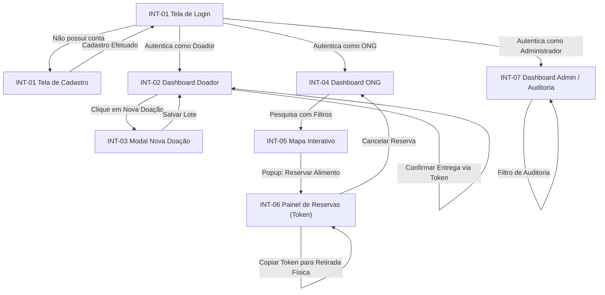

# Especificação de UI - Mesa Justa: Circuito Solidário

## Interfaces gráficas

Esta seção define as telas (interfaces gráficas), componentes de interface e regras de comportamento visual da plataforma Mesa Justa.

---

### INT-01 - Tela de Login e Cadastro (Autenticação)

- **Tipo de Contêiner**: Página inteira com formulário flutuante centralizado (estilo glassmorphism sobre fundo verde-escuro em gradiente suave).
- **Campos**:
  - *Visão Login*:
    - E-mail (Campo de texto com validação de formato e-mail).
    - Senha (Campo de texto com máscara de ocultação).
  - *Visão Cadastro (Expandido)*:
    - Razão Social / Nome Completo (Campo de texto livre).
    - Tipo de Perfil (Dropdown com opções: "Estabelecimento Doador", "ONG Beneficente").
    - CNPJ / CPF (Campo numérico formatado com máscara).
    - CEP (Campo numérico formatado para buscar endereço automaticamente).
    - Logradouro, Número, Bairro, Cidade e Estado (Preenchidos automaticamente via CEP, editáveis).
- **Botões**:
  - "Entrar" (Ação principal para submeter credenciais de login).
  - "Criar Conta" (Alterna a exibição para o formulário de cadastro).
  - "Confirmar Cadastro" (Ação principal para submeter os dados de registro).
  - "Voltar para Login" (Alterna o formulário de volta para o login).
- **Links**:
  - "Esqueci minha senha" (Redireciona para o fluxo de recuperação de e-mail).
  - "Termos de Uso Sanitário e LGPD" (Abre termos em uma janela externa).
- **Considerações**: O formulário deve validar CNPJ e CPF em tempo real, impedindo o envio caso o formato esteja incorreto. A seleção de estados bloqueia qualquer endereço que não seja de São Paulo (SP) ou Minas Gerais (MG) na fase inicial do MVP.

---

### INT-02 - Dashboard do Estabelecimento Doador (Visão Carlos)

- **Tipo de Contêiner**: Painel de controle responsivo composto por uma Barra Lateral (Sidebar) fixa à esquerda e uma Área de Conteúdo principal com Grade de Cartões (Grid de Cards) e tabelas à direita.
- **Campos**:
  - *Cards de Indicadores (Métricas)*:
    - Total de Alimentos Doados (Exibe valor em kg).
    - Moedas Verdes Acumuladas (Exibe o saldo de pontos).
    - Selo de Nível ESG (Exibe distintivo visual: Bronze, Prata, Ouro com base nas Moedas Verdes).
  - *Tabela de Doações Cadastradas*:
    - Listagem contendo colunas: Alimento, Categoria, Peso (kg), Validade, Status (Disponível, Reservada, Retirada, Expirada).
- **Botões**:
  - "+ Nova Doação" (Botão destacado de cor verde esmeralda no topo da página que abre o modal INT-03).
  - "Confirmar Entrega" (Botão de ação rápida na tabela, visível apenas quando o status da doação for "Reservada", abrindo popup para inserção do token).
- **Links**:
  - "Ver Histórico Completo de Doações" (Redireciona para a listagem expandida).
  - "Detalhes da ONG Reservante" (Link no nome da ONG na tabela, abre popover com dados de contato da ONG para apoio logístico).
- **Considerações**: O card "Moedas Verdes" e o selo ESG possuem micro-animações de pulso ao carregar a tela para incentivar o engajamento social.

---

### INT-03 - Modal de Cadastro de Lote de Alimentos (Doador)

- **Tipo de Contêiner**: Janela modal sobreposta com fundo semitransparente desfocado (backdrop-filter: blur).
- **Campos**:
  - Nome do Alimento (Campo de texto livre com limite de 50 caracteres).
  - Categoria (Dropdown contendo: Hortifrúti, Panificados, Laticínios, Mercearia, Proteínas, Refeições Prontas).
  - Peso Total (Campo numérico com suporte a decimais, unidade fixa em kg).
  - Data de Validade (Seletor de data - Datepicker).
  - Recomendações de Transporte / Armazenamento (Área de texto livre com limite de 200 caracteres).
- **Botões**:
  - "Salvar e Disponibilizar" (Botão principal que cria a doação).
  - "Cancelar" (Fecha o modal descartando as alterações).
- **Links**:
  - N/A.
- **Considerações**: O seletor de data bloqueia datas retroativas. Se a data selecionada for igual ao dia atual, exibe um alerta laranja em destaque abaixo do campo: "Atenção: Este lote expira hoje. A retirada deve ser imediata!".

---

### INT-04 - Dashboard da ONG (Visão Ana)

- **Tipo de Contêiner**: Painel de controle com Barra Lateral fixa à esquerda e Área de Conteúdo dividida em duas colunas: Filtros e Mapa Interativo (INT-05) ocupando 2/3 da largura, e Lista de Doações Disponíveis na lateral direita ocupando 1/3 da largura.
- **Campos**:
  - Filtro de Distância (Dropdown de opções de raio: "Até 5 km", "Até 15 km", "Até 30 km", "Qualquer distância").
  - Filtro de Categoria (Grade de checkboxes contendo as categorias dos alimentos).
- **Botões**:
  - "Aplicar Filtros" (Atualiza o mapa e a listagem de doações).
  - "Limpar Filtros" (Reseta os parâmetros para a localização padrão da ONG).
- **Links**:
  - "Minhas Reservas Ativas" (Abre a tela INT-06 na área de conteúdo).
  - "Histórico de Alimentos Coletados" (Abre histórico de coletas finalizadas).
- **Considerações**: A listagem lateral direita exibe cartões compactos de cada doação com nome do alimento, categoria, peso, validade e a distância em quilômetros em relação à sede da ONG (ex: "A 4.2 km de você").

---

### INT-05 - Mapa Interativo de Doações (ONG)

- **Tipo de Contêiner**: Mapa interativo integrado via biblioteca Leaflet.js, adaptável ao tamanho da tela.
- **Campos**:
  - Marcador de Localização da ONG (Pin verde com ícone de casa).
  - Marcadores de Doações (Pins laranjas com ícone correspondente à categoria do alimento).
  - Popup Informativo (Abre ao clicar em um pin de doação). Exibe: Nome do Doador, Descrição do Lote, Peso (kg), Tempo para expirar.
- **Botões**:
  - "Reservar Lote" (Botão principal de ação rápida dentro do popup do mapa).
  - "Centralizar Mapa" (Botão flutuante no canto superior direito para retornar o foco à localização da ONG).
- **Links**:
  - N/A.
- **Considerações**: A reserva realizada diretamente pelo mapa abre uma caixa de confirmação simples de segurança para evitar cliques acidentais.

---

### INT-06 - Painel de Reservas Ativas (ONG)

- **Tipo de Contêiner**: Tabela responsiva de reservas na área principal de conteúdo da ONG.
- **Campos**:
  - Colunas: Alimento Reservado, Estabelecimento Doador, Endereço de Retirada, Token de Retirada, Tempo Restante de Validade.
  - O Token de Retirada é exibido em uma caixa destacada de cor cinza e fonte monoespaçada em tamanho grande (ex: `MJ-A94D`).
- **Botões**:
  - "Cancelar Reserva" (Botão vermelho que libera o lote novamente para outras ONGs).
  - "Copiar Código" (Copia o Token de Retirada para a área de transferência do usuário).
- **Links**:
  - "Ver Rota de Retirada" (Abre rotas externas do Google Maps / Waze em nova aba do navegador).
- **Considerações**: Exibe um cronômetro regressivo atualizado dinamicamente em vermelho piscante caso falte menos de 2 horas para o vencimento do lote de alimentos.

---

### INT-07 - Dashboard Administrativo e Auditoria (Visão Juliana)

- **Tipo de Contêiner**: Painel analítico de alta fidelidade com barra lateral administrativa, gráficos e logs tabulares.
- **Campos**:
  - *Cards de Indicadores de Impacto*:
    - Alimentos Salvos (Exibe peso total consolidado em Toneladas).
    - Famílias Beneficiadas (Valor calculado $1\text{ kg} = 2 \text{ refeições}$).
    - CO2 Evitado (Valor calculado $1\text{ kg} = 2.5\text{ kg de CO2eq}$).
  - *Tabela de Log de Auditoria*:
    - Colunas: Registro ID, Data/Hora, Operação, Usuário Executor, Detalhes Técnicos.
- **Botões**:
  - "Exportar Relatório ESG" (Gera um documento PDF estilizado contendo os indicadores de impacto).
  - "Filtrar por Período" (Calendário duplo para restringir a análise).
- **Links**:
  - "Ver Ranking de Doadores" (Abre a listagem pública de Moedas Verdes dos parceiros).
- **Considerações**: A tabela de logs possui paginação assíncrona para garantir alta performance ao carregar milhares de registros de auditoria.

---

## Fluxo de Navegação

O diagrama abaixo representa a jornada dos usuários a partir da tela de autenticação, dividida pelas permissões de perfil (RBAC):

---

## Diretrizes para IA

Ao gerar código frontend, layouts ou estilizações para o Mesa Justa, os modelos de IA devem cumprir as seguintes regras imperativas de design:

1. **Paleta de Cores Coesa (Verde Ecológico & ESG)**:
   - *Cor Primária*: `#0e3a2f` (Verde escuro profundo para representar sustentabilidade e seriedade).
   - *Cor Secundária (Destaques/Ações)*: `#1b5e20` (Verde folha) ou `#2e7d32` para elementos de sucesso e "+ Nova Doação".
   - *Cor de Destaque*: `#ff6f00` (Âmbar/Laranja quente para avisos, expiração rápida e pins de doações no mapa).
   - *Cor de Fundo*: `#f5f5f5` para fundos claros; `#121212` para suporte a modo escuro.
2. **Glassmorphism**: Modais (como o `INT-03`), Sidebars e cabeçalhos de tabela devem usar propriedades de desfoque de fundo (`backdrop-filter: blur(8px)`) combinado com bordas muito finas semitransparentes (`border: 1px solid rgba(255, 255, 255, 0.15)`) para transmitir um visual premium e moderno.
3. **Tipografia Modernizada**: Utilizar a fonte do Google Fonts `Inter` ou `Outfit` como padrão em todo o documento CSS, com hierarquias de cabeçalho bem definidas (pesos de 500 para títulos normais, 700 para títulos principais e 400 para textos).
4. **Responsividade**: Layouts de Dashboards (`INT-02` e `INT-04`) devem se reorganizar para coluna única em telas móveis. O menu lateral (Sidebar) deve se transformar em um menu hamburguer colapsável em resoluções inferiores a `768px`.
5. **Acessibilidade WCAG 2.1**: Todos os botões e links de navegação devem conter identificadores únicos e explícitos (`id` e `aria-label`). A relação de contraste de cores entre textos e fundos deve ser mantida sempre em $4.5:1$ ou superior.
6. **Transições e Micro-animações**:
   - Botões principais devem possuir transição de hover suave (`transition: all 0.3s ease`).
   - Os marcadores do mapa (pins) e cartões de doação devem usar uma leve animação de deslocamento vertical (slide-up) ao serem renderizados na tela.
